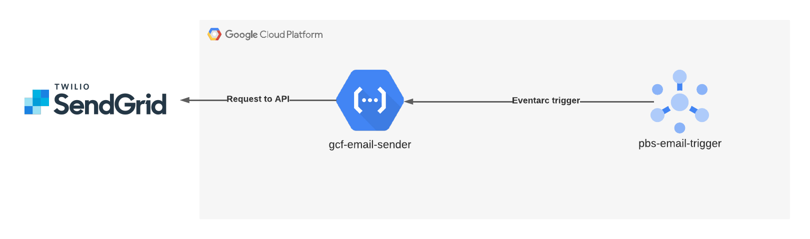

# GCF EMAIL SENDER

This service is a Google Cloud Function triggered by a pubsub publish event. It takes the message published and send and email containing the data in the message.

## Requirements

### Enable APIs

You will need to enable the following Google Cloud APIs:
- Cloud Function
- Cloud Run
- Pubsub
- Eventarc

### Cloud Build

Go to the GCP console, and in the Cloud Build settings make sure sur that the Cloud Build service account is allowed to deploy both Cloud Function and Cloud Run

### Service Account

This GCF uses a dedicated service account, it is not necessary but is considered a good practice, so you have it to create it before deploying.
First edit the `.env` file and source it.
Then use the following command line to create the service account:
`gcloud iam service-accounts create $GCF_SAC_NAME --display-name=$GCF_SAC_NAME`
And finally give it the role for the cloud function:
`gcloud projects add-iam-policy-binding $PROJECT_ID --member="serviceAccount:$GCF_SAC_EMAIL" --role=roles/cloudfunctions.invoker`

### Pubsub

This GCF is Triggered when a message is published in the pubsub. For that reason you must create the pubsub before deploying:
`gcloud pubsub topics create $PUBSUB_TOPIC`

## Deploy

To deploy the GCF you can just run the `deploy.sh` script:
`./scripts/deploy.sh`
